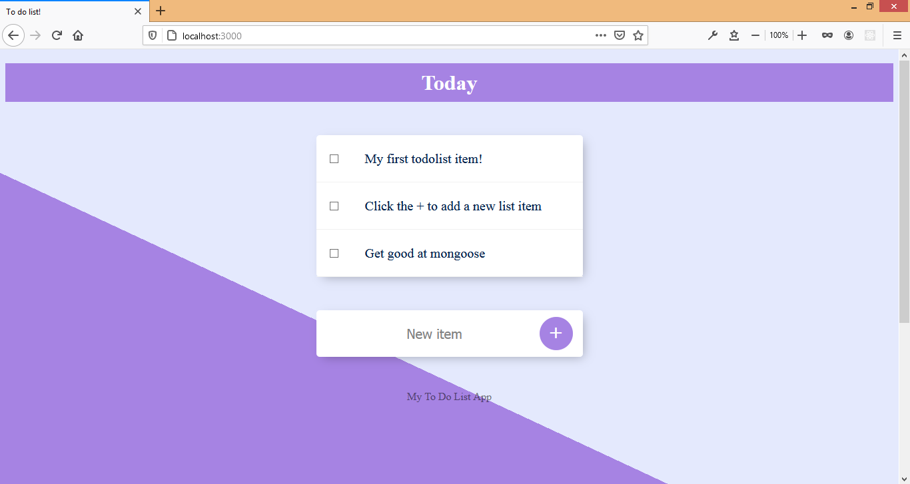
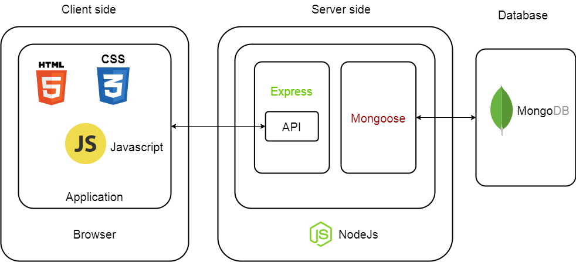
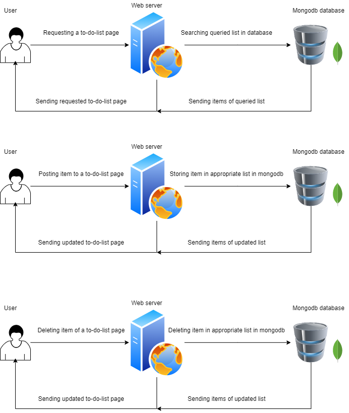

# To-do-list App

An App to manage a list of things to do. You can add and delete items to a list. You can create and manage multiple lists.

The App is deployed to heroku. You can find it here [todolist-app-heroku](https://radiant-earth-19029.herokuapp.com/)

Used Node.js and mongodb.

---

## Getting Started

- Download and install Node.js and mongodb.
- Clone this repository.
- Open terminal from project folder.
- Run npm install.
- Run mongod on a terminal.
- Run node app.js on another terminal.
- Go to localhost:3000 on browser.

---

## Architecture and process flow diagram

